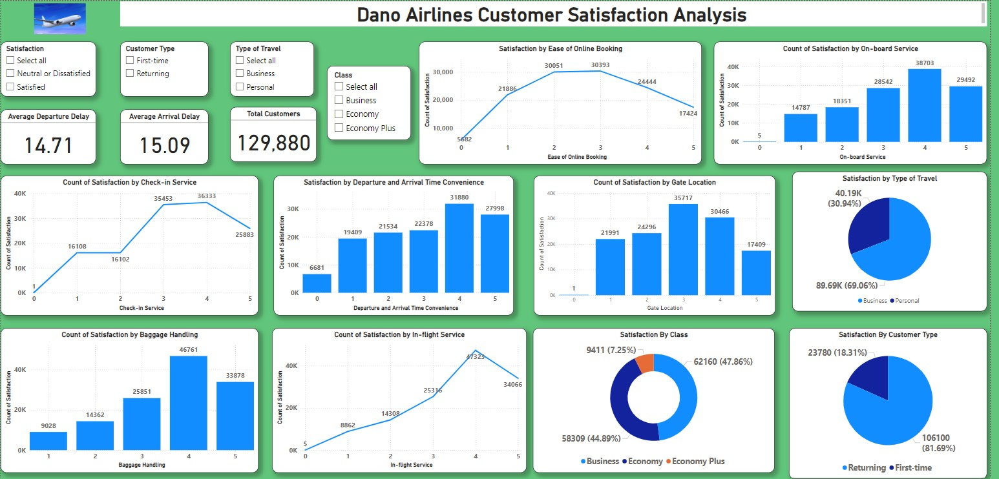

# Dano-Airlines

 

--- 

## Introduction:
This is a Power Bi project on Data Analyst for Dano Airlines, a Uk-based airline
headquartered in London, United Kingdom. The latest passenger survey results just came in and it looks
like the satisfaction rate dipped under 50% for the first time ever. The leadership team needs to take
action fast, hence the need for the data analysis and to find the key areas to focus on for getting
back on track.

---

## Problem Statement:
1. Recommend a data driven strategy for increasing Dano Airlines' satisfaction rate and
2. Present it in the form of a single page report or dashboard.

---

## Dashboard:

---

## Analysis:
**Overall Satisfaction:**
The total number of customers was 129,880
56,428 were satisfied while 73,452 were neutral or dissatisfied

**Satisfaction by Type of Travel**
_Business:_ 52,356 were satisfied while 36,115 were neutral or dissatisfied
_Personal:_ 4,072 were satisfied while 37,337 were neutral or dissatisfied

**Satisfaction by Customer Type**
_Returning:_ 5,700 were satisfied while 18,080 were neutral or dissatisfied
_First time:_ 50,728 were satisfied while 55,372 were neutral or dissatisfied

**Satisfaction by Class**
_Business:_ 43,166 clients were satisfied, while 18,994 were neutral or dissatisfied
_Economy:_ 10,943 clients were satisfied, while 47,366 were neutral or dissatisfied
_Economy plus:_ 2,319 clients were satisfied, while 7,092 were neutral or dissatisfied

**Satisfaction by Ease of Online Booking**
5 - 17424
4 - 24444
3 - 30393
2 - 30051
1 - 21886
0 - 5682

**Satisfaction by On-boarding Service**
5 - 29492
4 -  38703
3 - 28542
2 - 18351
1 - 14787
0 - 5

**Satisfaction by Check-in Service**
5 - 25883
4 -  36333
3 - 35453
2 - 16102
1 - 16108
0 - 1

**Satisfaction by Departure and Arrival Time Convenience**
0 - 6681
1 -  19409
2 - 21534
3 - 22378
4 - 31880
5 - 27998

**Satisfaction by Baggage Handling**
5 - 33878
4 - 46761
3 - 25851
2 - 14362
1 - 9028

---

## Conclusion and Recommendations:
There is a high lever of disatisfaction in the _Economy Class:_ where 10,943 clients were satisfied, while 47,366 were neutral or dissatisfied and also in the 
_Economy plus class:_ where 2,319 clients were satisfied, while 7,092 were neutral or dissatisfied. The management should focus on improving services and customer experience for the members of Economy and Economy pluss class.

There was also a high lever of disatisfaction among _Personal type of travel_ clients where 4,072 were satisfied while 37,337 were neutral or dissatisfied. The management should invest in entertainment to make the holiday or vacation feeling a reality among the personal travel type of clients. The should also improve on their services to ensure a good flow of business.

The airline should also come up with ways of ensuring customer retention as _Returning type of customers:_ 5,700 were satisfied while 18,080 were neutral or dissatisfied

---

